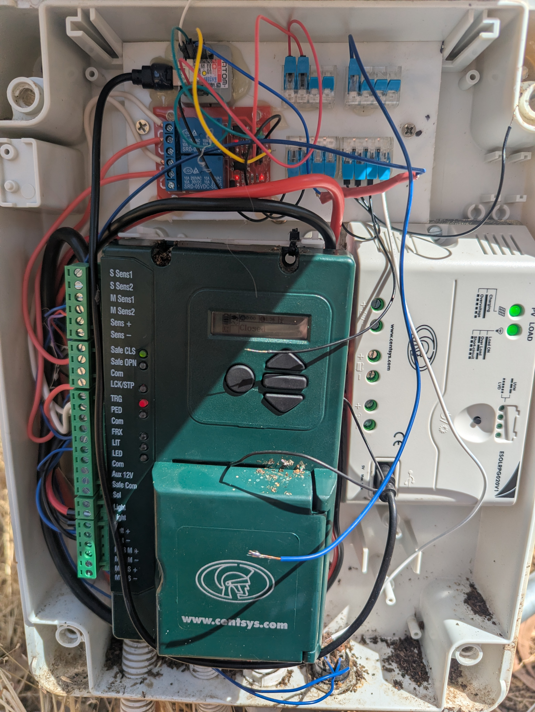

One of the first smart property projects completed was automating an existing rural property gate without replacing the original gate motor or control system.

The goal was to improve convenience while retaining the existing hardware.



## The Challenge

The gate already had a functioning motor and remote controls, however there was no way to monitor its status, automate operation or integrate it with other property systems.

Replacing the entire gate system would have been expensive and unnecessary.

## The Solution

A low-cost retrofit was installed to integrate the existing gate hardware with Home Assistant.

The solution provides:

- Gate status monitoring
- Remote control from a phone
- Automation through Home Assistant
- Event logging and notifications
- Vehicle presence detection
- Automatic opening for authorised vehicles

## Existing Gate Controller

The automation system was retrofitted to an existing Centsys gate controller rather than replacing the entire gate automation system.

The original motor, controller and safety systems remain fully operational.

A small relay interface was added to allow Home Assistant to monitor and control the gate while preserving normal operation from remotes and existing controls.

This approach significantly reduced costs while providing modern smart-property functionality.

## Automatic Vehicle Detection

Bluetooth beacons installed in regular vehicles allow Home Assistant to detect when authorised vehicles approach the property.

When a recognised vehicle arrives, the system can automatically open the gate without needing a remote control or phone interaction.

Presence detection is already operating successfully and forms the foundation for further automation.

## How It Fits Together

```text
Vehicle Bluetooth beacon
        ↓
Home Assistant presence detection
        ↓
Automation logic
        ↓
Relay interface
        ↓
Existing Centsys gate controller
        ↓
Gate opens